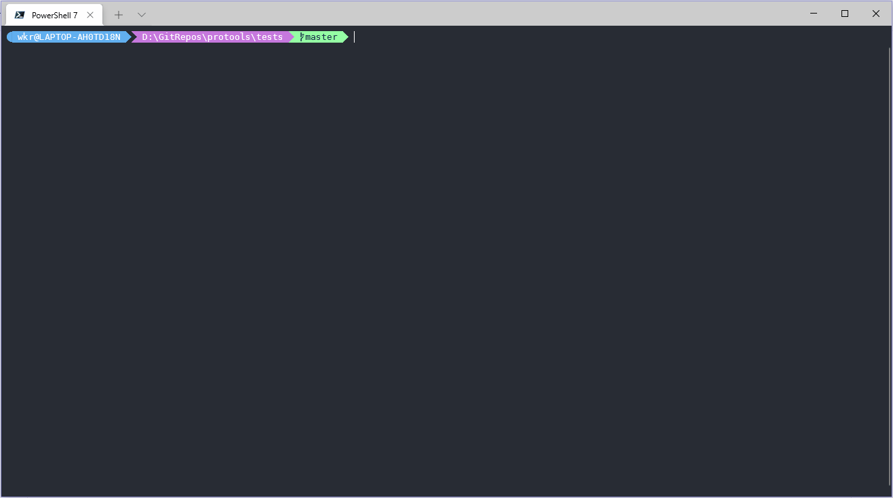
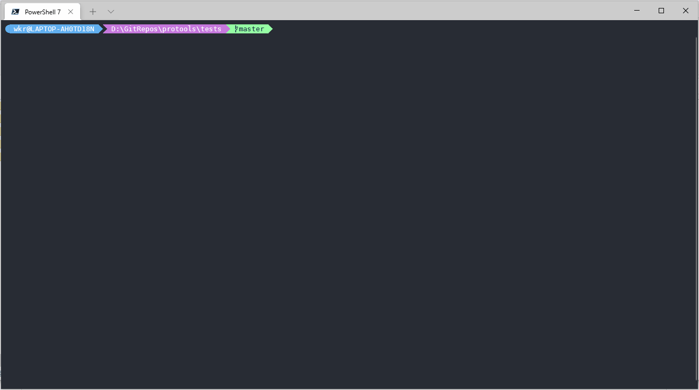

# protools

一个实现了批量将`protobuf`**数据**自动识别为**类**`json`**格式**，批量将`proto`**定义文件**转为`python`**类**。

适用于需要转换大量的`protobuf`**数据**或`proto`**定义文件**。

> 暂时只在`Windows 10 x64`、`Ubuntu 20.04 x64`的中文环境下做过测试，其他系统或语言环境如有问题欢迎提交issue。

## install

```shell
pip install protools
```

## use

```shell
python -m protools -f ... -i ... -o ...
protools -f ... -i ... -o ...
```

其中`-f`可选参数有`b2j`[`buf2json`]、`p2p`[`proto2python`]。
其中`-i`是输入文件夹，`-o`是输出文件夹，其合法关系有`一对一`、`多对一`、`多对多`，当使用`多对多`关系时，应确保输入文件夹和输出文件夹一一对应（见demo2）。

## demo

1. 将`data`和`net`文件夹中所有文件当作`protobuf`**数据**批量自动识别为**类**`json`**格式**并写入到`json`文件夹。
   ```shell
   protools -f b2j -i data -i net -o json
   ```
   
2. 将`data`和`net`文件夹中所有文件当作`protobuf`**数据**批量自动识别为**类**`json`**格式**并分别写入到`data_json`和`net_json`文件夹。
   ```shell
   protools -f b2j -i data -i net -o data_json -o net_json
   ```
   
3. 将`proto`文件夹中的所有文件当作`proto`**定义文件**批量转为`python`**类**并写入到`python`文件夹。
   ```shell
   protools -f p2p -i proto -o python
   ```
   

## License

[GPLv3](LICENSE)
